# asciiplay

**A native video and audio player with a terminal soul.** Anything it plays can be turned
into live, coloured ASCII art, 1-bit Bayer-dithered pixels or the glowing edge traces of a
vector display, rendered by fragment shaders on the GPU so it keeps the video's frame rate
even fullscreen at 5120x1440, and that picture can be put behind the glass of a simulated
CRT monitor: curved tube, shadow mask, scanlines, bloom, grain and phosphor afterglow. Audio files play through the same path as one of five ffmpeg
visualisers. Around that sits an ordinary, complete player built on libmpv: hardware
decoding, audio and subtitle tracks, crop presets, speed, frame stepping, screenshots,
text export, a playlist with repeat and shuffle, drag and drop, desktop integration.

Single file, Python, no browser, no Electron: `asciiplay.py` on top of libmpv, PyQt6 and numpy.

<p align="center">
  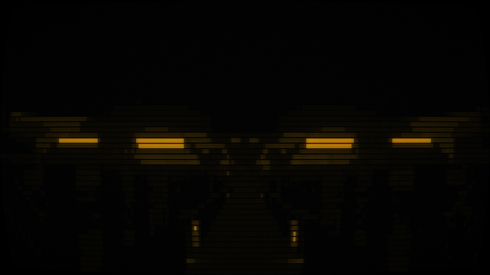
  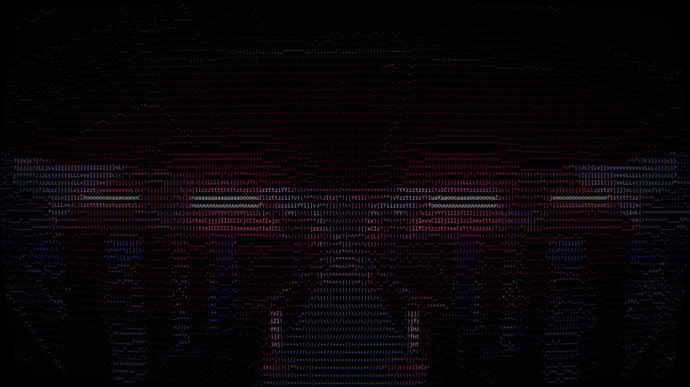
</p>
<p align="center">
  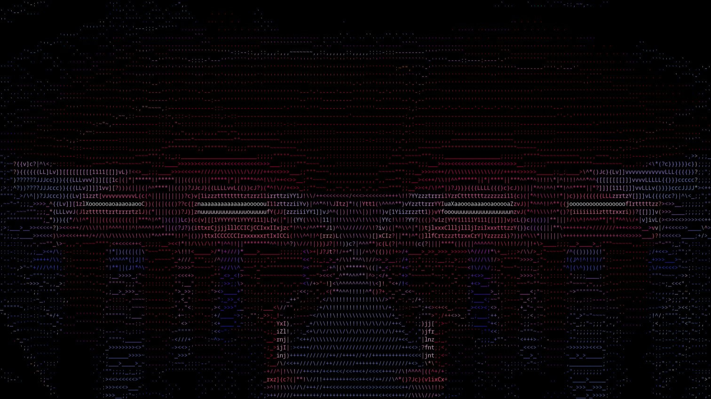
  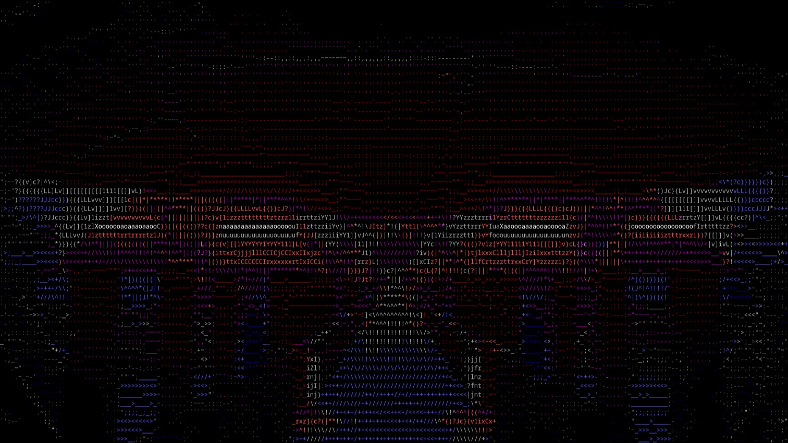
</p>
<p align="center">
  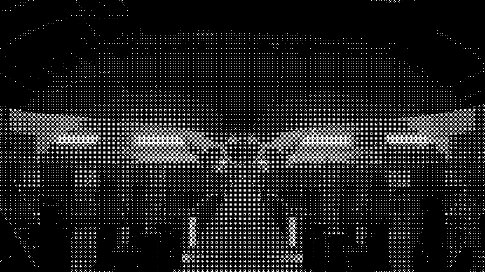
  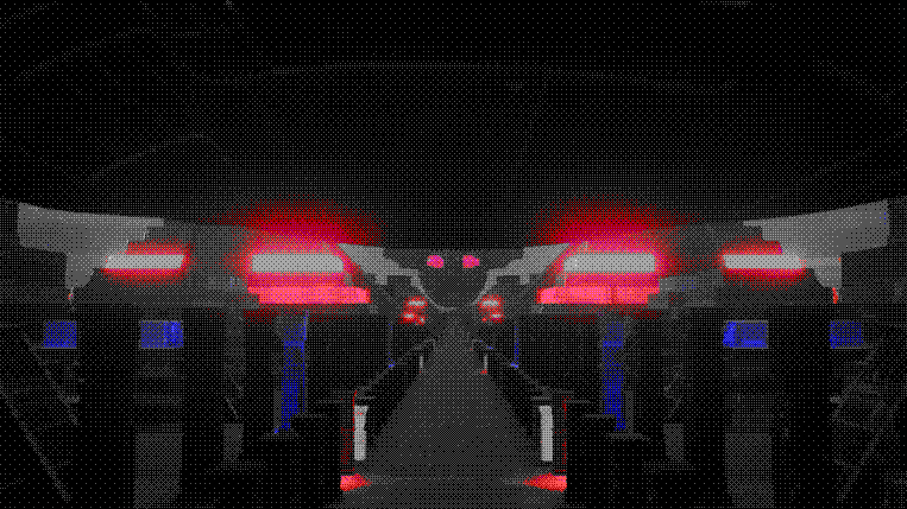
</p>
<p align="center">
  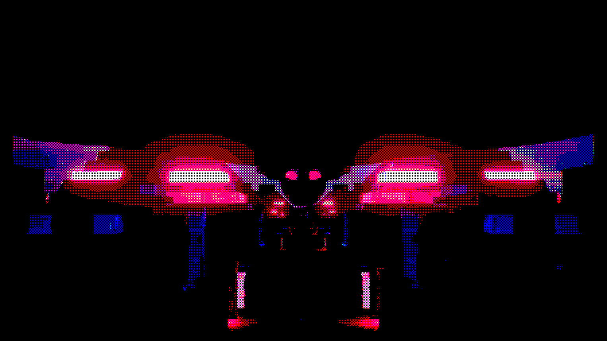
  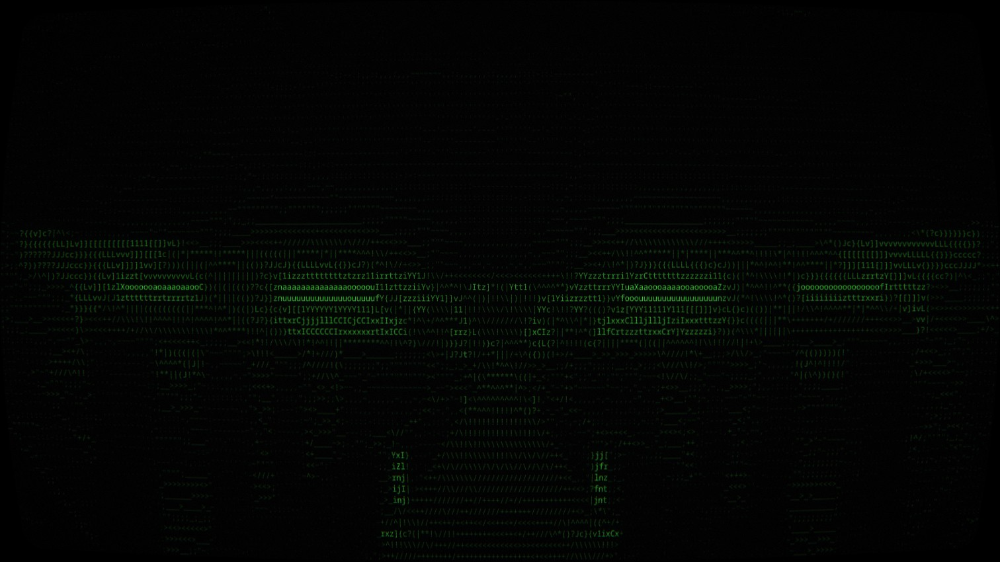
</p>
<p align="center">
  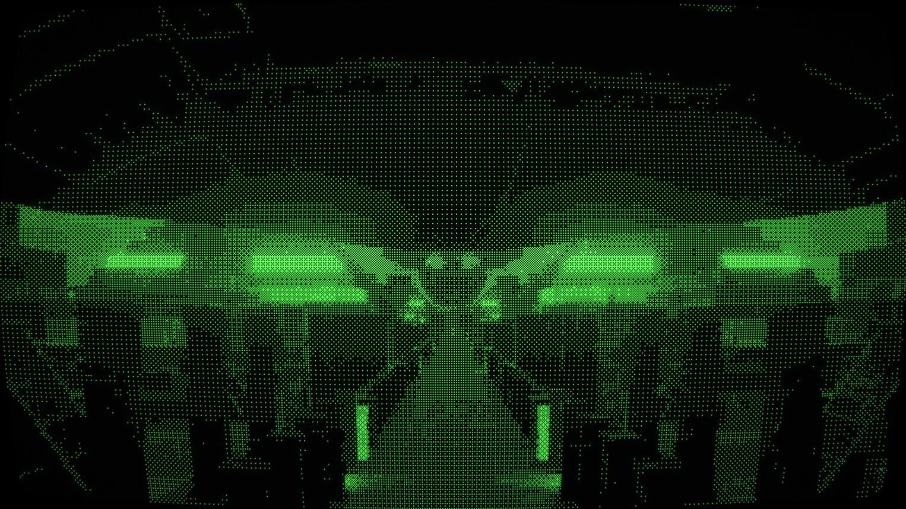
  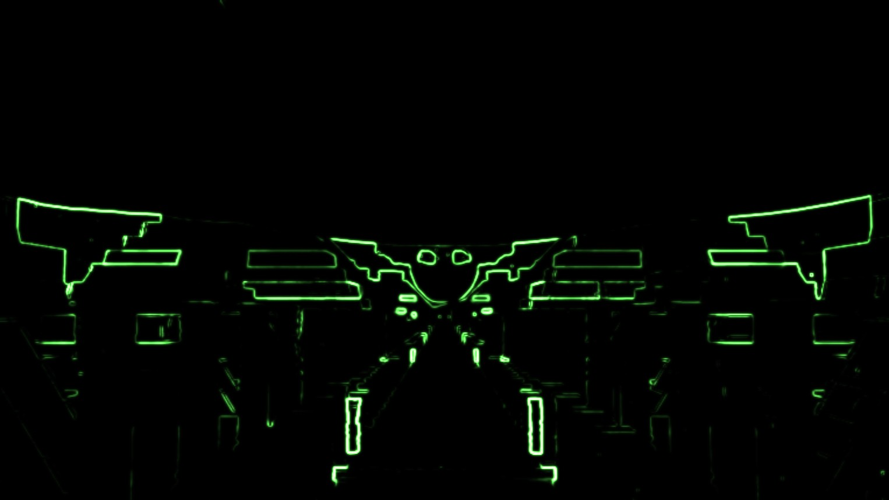
</p>
<p align="center">
  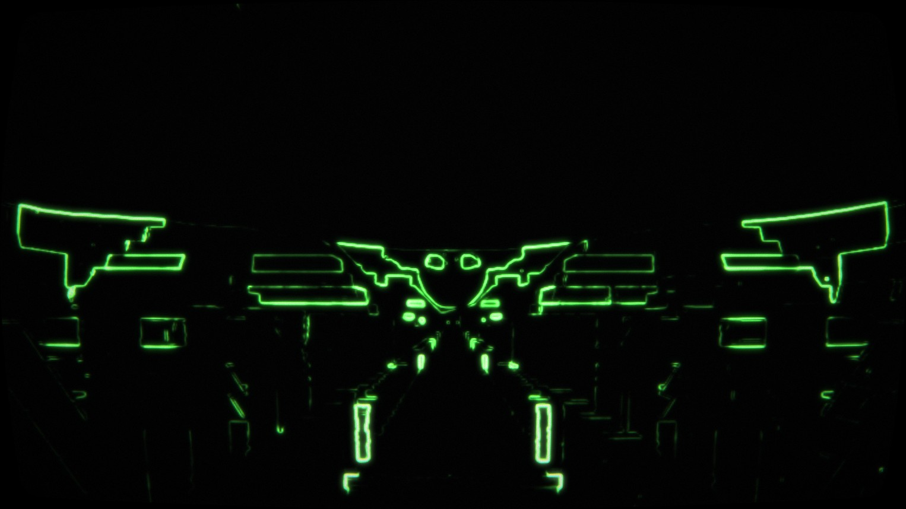
</p>
<p align="center">
  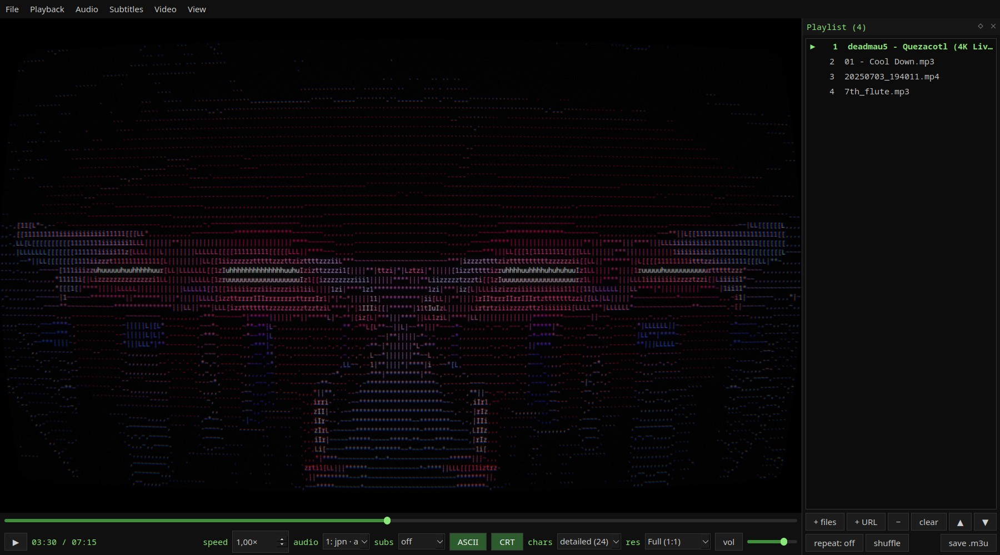
</p>
<p align="center"><sub>One frame of deadmau5 - Quezacotl (live show visualizer) through the
display filters: ASCII art, the same in 16 colours, Bayer dithering at 4x4, 8x8 and 2x2, three
of them behind the CRT glass, and the vector display. The
<a href="screenshots/original.jpg">original frame</a> for comparison. All of them are the
player's own Ctrl+C output; the dithered ones are PNG so the pattern stays exact, the rest JPG.</sub></p>

## Why this exists

There are many ASCII video players, and they all live in a terminal: decoded on the CPU,
limited to the terminal's cell grid, mostly without sound, tracks or a real UI. There are
CRT shaders for emulators and video players, and browser toys that put ASCII and
scanlines on a clip you upload. asciiplay is, as far as I can tell, the only one that
puts the whole thing together in one desktop player - ASCII conversion, 1-bit ordered
dithering, a vector display and the CRT look as GPU shader passes inside a real window, on
top of an actual media player.

Single file: `asciiplay.py`. Built on [libmpv](https://mpv.io/) for decoding/tracks/speed,
[PyQt6](https://pypi.org/project/PyQt6/) for the window, OpenGL for putting frames on the
screen (video and display filters alike run on the GPU), and numpy for the ASCII text
export and the software fallback.

## Features

- **GPU rendering.** mpv draws straight into an OpenGL widget, and every display filter is
  a fragment shader, so a 5120x1440 fullscreen ASCII, dithered or vector picture costs
  about as much as drawing a texture - 120 fps content plays at 120 fps in fullscreen. Hardware decoding (nvdec,
  vaapi) hands frames to the renderer without a round trip through system memory. If
  OpenGL isn't available the old CPU renderer takes over automatically (`--renderer`).
- **Drag & drop** video, audio, subtitle files, or URLs onto the window (or use `File > Open`).
- **Playlist panel** (`l`) — a dock on the right showing mpv's playlist with the playing entry
  marked. Add files (`Shift+O`, the `+ files` button, or drop files/URLs straight onto the
  list), add a URL, remove entries (`Delete`), clear, reorder by dragging rows or with the
  ▲ ▼ buttons, double-click an entry to play it, and save the list as an `.m3u`. The panel
  steps aside in fullscreen and comes back afterwards.
- **Repeat and shuffle** — `Shift+L` cycles repeat off / whole playlist / this file (also
  Playback -> Repeat), `Ctrl+L` shuffles the playlist and, pressed again, restores the
  original order. Both are buttons in the playlist panel too.
- **YouTube and friends**: paste a page URL (`Ctrl+U`, drag it in, or give it on the command
  line) and mpv resolves it through [yt-dlp](https://github.com/yt-dlp/yt-dlp) - any site
  yt-dlp supports, and YouTube playlists land in the playlist panel. Default quality is the
  best stream up to 1080p; `--ytdl-format` changes that (e.g.
  `--ytdl-format 'bestvideo[height<=?2160]+bestaudio/best'` for 4K). Needs `yt-dlp`
  installed (`sudo dnf install yt-dlp` / `sudo apt install yt-dlp`); the player says so if
  it is missing. If YouTube answers *"Sign in to confirm you're not a bot"*, see
  [When YouTube says "confirm you're not a bot"](#when-youtube-says-confirm-youre-not-a-bot).
- **Audio & subtitle track switching**, including externally-added subtitle files.
- **Playback speed** control (0.1x - 8x), frame stepping, volume/mute.
- **Seeking** by dragging the seek bar, or clicking anywhere on it to jump straight there.
- **Crop / aspect ratio** (`c`) — cycle through the usual target ratios (16:9, 16:10,
  1.85:1, 2.00:1, 2.21:1, 2.35:1, 2.39:1, 4:3, 5:4, 1:1) to centre-crop the picture and
  cut off baked-in black letterbox/pillarbox bars, like VLC's `c`. Also available in the
  Video menu; resets to off when a new file is opened. Works with the display filters too.
- **Display filters** (`t`) — the picture is converted live into one of three retro
  looks, using mpv's own decoder output, so it works for anything mpv can play. `t`
  cycles off -> ASCII -> Bayer 2×2 -> Bayer 4×4 -> Bayer 8×8 -> vector -> off; `Shift+T`
  (or the button in the control bar) switches the current one on and off, and the
  `filter` dropdown picks one directly.
  - **ASCII art** — coloured monospace text. 6 character sets from just a few characters
    to a lot (`blocks`, `minimal`, `simple`, `digits`, `detailed`, `classic`), picked from
    a dropdown in the control bar or cycled with `r`; adjustable character size
    (`Ctrl+-` / `Ctrl+=`). Save the current frame as plain text or ANSI-coloured text
    (`s`).
  - **Bayer 1-bit dithering** — ordered dithering with a 2×2, 4×4 or 8×8 Bayer matrix,
    the look of a Macintosh, Atari ST or Amiga 1-bit screen. Each grid pixel is
    thresholded against the matrix, so gradients turn into the classic crosshatch
    patterns. Pixel size is `--pixel-size` (default 2 screen pixels, `Ctrl+-` /
    `Ctrl+=` while it is on) times the resolution divider.
  - **Vector display** — a Sobel edge detector runs over the picture and the edges are
    drawn as bright, glowing beam traces on black, like a Vectrex or an Asteroids cabinet.
    Bilinear upscaling from the pixel grid keeps the traces smooth; a white-hot core and
    a soft halo stand in for the beam.
  - 8 **colour modes** cycled with `e`, applying to all three filters: full colour, raw,
    green, amber, mono, and three quantised palettes - **8 colours** (the 3-bit RGB set of
    the ZX Spectrum / BBC Micro), **16 colours** (CGA/EGA) and **32 colours**
    (DawnBringer's DB32 pixel-art palette). With the Bayer filters the palettes dither
    between neighbouring palette colours (the classic EGA look), `color` dithers each RGB
    channel to one bit, `raw` is pure black and white, and the phosphor modes are black
    and the tube colour; with the vector filter `color` draws each edge in the picture's
    own hue at full beam brightness (a colour vector monitor like Tempest's) while the
    phosphor modes draw the classic monochrome beam.
  - The `green`, `amber` and `mono` modes are a **CRT phosphor** look: the tube colour
    glows through the midtones, highlights bloom brighter, and the very brightest pixels
    desaturate towards near-white like a real monitor's beam blowing out.
  - **Resolution divider** — Full / Half / Quarter, in a dropdown next to the character
    set, or cycled with `d`. Half and Quarter use a quarter and a sixteenth as many
    character cells (or dither/vector pixels) respectively - fewer, bigger ones stretched
    to still fill the window - for a chunkier look; with the software renderer it is also
    the biggest lever for smoother playback in a large window. Applies to audio files
    too, since they render through the same path.
  - **CRT screen** (`g`) — an optional filter layered on top of whatever display filter is
    on (video and the audio visualiser alike) that makes the window look like an old tube
    monitor: curved glass with rounded corners and a vignette, an aperture-grille shadow
    mask, scanlines (a whole number per character row, or of dither rows per scanline),
    bloom/glow around bright glyphs, colour convergence error towards the edges, fine
    grain, a faint hum bar rolling down the tube, and phosphor afterglow — bright,
    fast-moving things leave a short trail (green lingers longest, like real phosphor).
    On the vector display the shadow mask and scanlines are left out (a vector monitor has
    neither) and the afterglow is longer, so moving edges trail like on a real tube. Three
    intensities (`subtle`, `normal`, `heavy`), cycled with `Shift+G` or picked from
    Video -> CRT intensity; a `CRT` button sits next to the filter button in the control
    bar. Screenshots include it. Needs the OpenGL renderer (it is a few more shader
    passes); the software fallback ignores it and says so.
- **Screenshots** (`Ctrl+C`) — saves what is on screen as a JPG (or PNG) file, cropped to
  the picture: the video itself, or the filtered picture when a display filter is on. Like the
  text export it pauses, asks where to save (defaulting to your home folder with a
  timestamped name), and resumes.
- **Audio files always show an ASCII visualiser** (waveform / spectrum / frequency bars /
  CQT bars / oscilloscope), driven by ffmpeg's `showcqt`/`showwaves`/... filters through
  mpv's `lavfi-complex`, then run through the same ASCII renderer.
- **Dependency self-check**: on start (or with `--check`) it looks for PyQt6, numpy,
  libmpv and python-mpv and, if anything is missing, prints the exact `sudo` command to
  install it for your distro (Nobara/Fedora, Debian/Ubuntu, Arch, openSUSE) instead of
  just crashing.
- No hard-coded paths: it's a single portable Python script.

## Install (Nobara / Fedora)

```bash
sudo dnf install python3-pyqt6 mpv-libs python3-mpv
```

`mpv-libs` needs RPM Fusion and `python3-mpv` needs the Terra repository — both are
enabled by default on Nobara. If `python3-mpv` isn't found, install it with pip instead:

```bash
python3 -m pip install --user python-mpv
```

If you're not sure what's missing, just run the app — it detects your distro and prints
the exact command:

```bash
python3 asciiplay.py --check
```

### Other distros

```bash
# Debian / Ubuntu / Mint
sudo apt install python3-pyqt6 python3-numpy libmpv2 python3-mpv

# Arch / Manjaro
sudo pacman -S python-pyqt6 python-numpy mpv python-mpv

# openSUSE
sudo zypper install python3-PyQt6 python3-numpy libmpv2
python3 -m pip install --user python-mpv
```

## Run

```bash
python3 asciiplay.py                 # empty player, drag & drop something in
python3 asciiplay.py movie.mkv       # open a file directly
python3 asciiplay.py song.flac       # opens straight into the ASCII visualiser
python3 asciiplay.py --ascii clip.mp4 --font-size 10
python3 asciiplay.py --ascii --crt clip.mp4          # ASCII art on a CRT screen (--crt-level subtle|normal|heavy)
python3 asciiplay.py --filter bayer4 clip.mp4        # start with a display filter: ascii, bayer2/4/8 or vector
python3 asciiplay.py --filter vector --crt --pixel-size 3 clip.mp4
python3 asciiplay.py "https://www.youtube.com/watch?v=..."   # needs yt-dlp
python3 asciiplay.py --ytdl-cookies-from-browser firefox "https://youtu.be/..."  # if YouTube blocks it
python3 asciiplay.py --fullscreen movie.mkv   # start in fullscreen
python3 asciiplay.py --fps movie.mkv          # print drawn frames/s to the terminal
python3 asciiplay.py --renderer software x.mp4  # force the CPU path (default: auto = OpenGL, fall back)
python3 asciiplay.py --hwdec no x.mp4         # software decoding (default: auto-safe)
```

Make it executable and it can be launched like a normal program:

```bash
chmod +x asciiplay.py
./asciiplay.py
```

## When YouTube says "confirm you're not a bot"

Sometimes YouTube refuses to hand yt-dlp a stream and answers `Sign in to confirm you're
not a bot`. This is an anti-bot check on YouTube's side, keyed to your IP address and how
many requests have come from it recently - nothing in asciiplay, mpv or yt-dlp is broken,
and you can confirm that in a terminal:

```bash
yt-dlp --get-url "https://www.youtube.com/watch?v=..."   # fails the same way, on its own
```

Three things help, in the order worth trying:

```bash
# 1. let yt-dlp use your browser's YouTube login (the reliable cure)
python3 asciiplay.py --ytdl-cookies-from-browser firefox "https://www.youtube.com/watch?v=..."
#    also: chrome, chromium, brave, edge, opera, vivaldi, safari - and a profile may follow,
#    e.g. --ytdl-cookies-from-browser "firefox:default". Log in to YouTube in that browser
#    first, and close it while asciiplay reads the cookie database.

# 2. make yt-dlp identify as a different YouTube player client - no cookies needed, but
#    which client gets through changes from week to week
python3 asciiplay.py --ytdl-client android_vr "https://www.youtube.com/watch?v=..."

# 3. wait a few minutes; a burst of requests from one address trips the check for a while
```

`--ytdl-raw-options` passes anything else straight to yt-dlp in mpv's
`--ytdl-raw-options` syntax if you need a knob the two options above do not cover. Keeping
`yt-dlp` up to date matters too (`sudo dnf upgrade yt-dlp`), since YouTube changes what it
accepts and yt-dlp follows.

When the check trips, the player says so on screen and names the flag to use rather than
just showing "could not play this file".

## Desktop integration - app icon, and opening files by double-click

Run the installer once (dependencies don't need to be installed first for this part):

```bash
./install.sh
```

This installs, all under your own `~/.local/share` - nothing system-wide, nothing needing
sudo:

- the app icon (`asciiplay.svg` plus PNG fallbacks at the standard sizes) into the
  `hicolor` icon theme, so it shows up in the taskbar, alt-tab, and app launcher;
- `asciiplay.desktop`, pointing `Exec=` at this exact copy of `asciiplay.py` (re-run the
  installer if you move the folder);
- and, unless you pass `--no-default`, it makes asciiplay the default opener for common
  video and audio types (mp4, mkv, webm, avi, mov, mpeg, flv, wmv, ogg/ogv, mp3, flac,
  wav, m4a, aac, wma, aiff, ape and a few more) via `xdg-mime default`, so double-clicking
  one in your file manager opens it in asciiplay.

To switch a specific type back to another player later, either right-click a file of
that type -> Open With -> pick the other player -> set as default, or from a terminal:

```bash
xdg-mime default org.videolan.VLC.desktop video/x-matroska   # example: mkv back to VLC
```

`install.sh` is safe to re-run any time (e.g. after moving the folder, or to reapply
after another app steals a file type back).

## Keyboard shortcuts

| Key | Action |
|---|---|
| `Space` / `K` / `P` | Play / pause |
| `PgUp` `PgDown` (or `<` `>`) | Previous / next in playlist |
| `L` | Playlist panel |
| `Shift+O` | Add files to the playlist |
| `Shift+L` | Repeat mode: off / all / one |
| `Ctrl+L` | Shuffle playlist (again: restore order) |
| `←` `→` | Seek 5s |
| `↓` `↑` | Seek 60s |
| `,` `.` | Frame step back / forward |
| `[` `]` | Speed -/+ 10% |
| `{` `}` | Speed ÷2 / ×2 |
| `Backspace` | Speed reset to 1x |
| `A` | Next audio track |
| `J` / `Shift+J` | Next subtitle track / subtitles off |
| `Z` `X` | Subtitle delay -/+ 0.1s |
| `M` | Mute |
| `+` `-` | Volume |
| `T` | Next display filter: off / ASCII / Bayer 2×2 / 4×4 / 8×8 / vector |
| `Shift+T` | Current display filter on/off |
| `C` | Cycle crop / aspect ratio (cuts baked-in black bars) |
| `E` | Next colour mode (colour / raw / green / amber / mono / 8 / 16 / 32 colours) |
| `R` | Next character set (ASCII) |
| `D` | Next resolution (Full / Half / Quarter): characters or dither pixels |
| `G` | CRT screen on/off (on top of the display filter) |
| `Shift+G` | Next CRT intensity (subtle / normal / heavy) |
| `Ctrl+-` / `Ctrl+=` | Smaller / bigger characters (ASCII) or pixels (Bayer / vector) |
| `V` | Next audio visualiser |
| `S` | Save current ASCII frame to a text file |
| `Ctrl+C` | Save a screenshot (JPG/PNG) of the current picture |
| `F` / `F11` | Fullscreen |
| `Escape` | Leave fullscreen |
| `B` | Keep seek bar visible in fullscreen: on/off |
| `O` | Open file |
| `Ctrl+U` | Open URL (direct media links, or YouTube & co via yt-dlp) |
| `Ctrl+J` | Add subtitle file |
| `H` / `F1` | Show all shortcuts |

By default, the seek bar fades in on entering fullscreen and then stays up the whole time
so you can always see playback progress; the rest of the controls (play button, tracks,
speed, volume) hide after a couple of seconds of inactivity and only reappear while the
mouse is near the bottom edge. Toggle this with `B` (or View -> "Keep seek bar visible in
fullscreen") if you'd rather the seek bar hide and reappear together with the rest.

## How it renders

The video widget is a `QOpenGLWidget` and mpv's render API draws into it in OpenGL mode:
decoding (hardware where possible - with nvdec the frames stay on the graphics card as
CUDA surfaces), colour conversion, scaling and letterboxing all happen on the GPU, and the
GUI thread does about half a millisecond of work per frame regardless of window size.
mpv's "new frame" callback wakes the widget straight away (via a tiny helper thread, since
PyQt6 can't take a signal from libmpv's native thread), so frames aren't quantised to a
poll timer.

For the ASCII filter, mpv is asked to render the frame into a small off-screen framebuffer
of exactly one pixel per character cell (mpv's own scaler does that downsampling, with
`correct-downscaling` so a 6x reduction doesn't alias). A fragment shader then does the
rest per screen pixel: read that cell's colour, map its brightness through the gamma ramp
to a character, look the character up in a pre-rendered glyph atlas texture, and tint it
according to the colour mode (full colour / raw / the CRT phosphor looks). Nothing is read
back to the CPU during playback - only when you save a frame as text (`s`) is the
cell-sized render fetched once and turned into text with numpy, and a screenshot
(`Ctrl+C`) simply reads the widget's framebuffer back.

The Bayer and vector filters reuse that same setup with a grid of square pixels instead
of character cells: mpv renders one pixel per grid pixel into the small framebuffer, and a
shader either thresholds each of them against the Bayer matrix (computed on the fly from
the pixel coordinates by bit-interleaving, so the 2×2, 4×4 and 8×8 variants are the same
code) or, for the vector display, first runs a Sobel edge detector over the small render
into a second grid-sized framebuffer and then upscales that bilinearly while adding the
beam core and halo. The palette modes look up the nearest entry in a constant table
compiled into the shaders. All of it has a numpy twin for the software renderer.

With the CRT screen on, the filter shader draws into an off-screen framebuffer instead of
the window and three small passes follow: one folds the picture into a persistence buffer
(each pixel becomes the brighter of the new frame and the decayed previous one, with
per-channel decay times so trails go slightly green - that is the afterglow), one blurs a
half-size, highlight-weighted copy for the bloom, and the last one composes the tube on
screen: barrel distortion with a rounded face, convergence error, scanlines, the aperture
grille, bloom, grain, hum bar and vignette. All of it is per-pixel shader work, so it
costs a few extra full-screen texture reads and still runs at the source frame rate in a
5120x1440 fullscreen window. While paused the widget keeps repainting at 25 Hz so the
grain and the afterglow keep living.

Subtitles are drawn
by the app itself on top of the ASCII grid with QPainter (mpv's own subtitle burn-in is
disabled while the filter is active), so text stays crisp instead of being ascii-fied
along with the picture.

If you ever see bands of horizontal line noise in the lower part of the picture with
hardware decoding on an NVIDIA card: that is the CUDA decoder and mpv's 16-bit *float*
intermediate framebuffers aliasing in the driver (seen with driver 595). asciiplay sets
`fbo-format=rgba16` for that reason, which renders clean; `--hwdec no` is the fallback if
it ever comes back.

One non-obvious detail: the seek bar and time label are refreshed from a 10 Hz timer
rather than on every `time-pos` notification. Next to a GL widget, every repaint of an
ordinary widget makes Qt recomposite the whole window, and at 60 repaints a second that
alone cost a third of the fullscreen frame rate.

`--renderer software` (or an OpenGL setup mpv can't use) keeps everything on the CPU:
mpv renders into a numpy array, the glyphs are composited with numpy from the same atlas,
and QPainter blits the result. That path reuses its scratch buffers across frames and is
fine for a normal-sized window, but a 5120x1440 fullscreen ASCII picture is ~26 fps there
versus the display's refresh rate on the GPU.

For audio files, mpv builds a video stream out of the audio via
`lavfi-complex=[aid]asplit[ao][a];[a]<ffmpeg visualiser filter>,format=rgb24[vo]` and that
generated video is what gets ASCII-ised, so the "video so it looks like a terminal" effect
and the "visualise the music" feature are the same code path. The trailing `format=rgb24`
is not decoration: `showwaves`, `showfreqs` and `avectorscope` emit RGBA with a transparent
background, and libmpv leaves stale colour behind in fully transparent pixels, so without
it everything a visualiser had ever drawn stayed on screen. Transparent pixels in real
video files (an alpha webm) are shown over black rather than mpv's default checkerboard,
which the ASCII filter would otherwise turn into a wall of grey glyphs.

## License

MIT, see `LICENSE`. Copyright (c) 2026 Alexander Riedel. Built on libmpv, PyQt6, numpy and ffmpeg, each under their own licenses.
